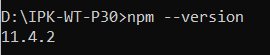

# ЛР00 — Отчёт об установке окружения

ФИО: Ярмола Александр Олегович
Идентификатор: p30_yarmola

## Установлено

- Git: 2.45.1.windows.1
- .NET SDK: 8.0.414
- Node.js: v22.13.1
- npm: 11.4.2
- VS Code: 1.89.1 (см. скриншот)
- SQL Server LocalDB: MSSQLLocalDB

## Скриншоты

- **Git:**  
  
  _Рис. 1 — Проверка версии Git (git --version)_

- **.NET SDK:**  
  
  _Рис. 2 — Проверка версии .NET SDK (dotnet --version)_

- **Node.js:**  
  
  _Рис. 3 — Проверка версии Node.js (node --version)_

- **npm:**  
  
  _Рис. 4 — Проверка версии npm (npm --version)_

- **VS Code:**  
  
  _Рис. 5 — Окно "About" в VS Code_

- **SQL Server LocalDB:**  
  
  _Рис. 6 — Проверка MSSQLLocalDB (sqllocaldb info)_

## Краткое описание установки

- **Git** установлен по умолчанию в папку `C:\Program Files\Git`.
- **.NET SDK 8.0.414** установлен по умолчанию в ` C:\Program Files\dotnet`.
- **Node.js** и **npm** установлены по умолчанию в `C:\Program Files\nodejs`.
- **Visual Studio Code** установлен по умолчанию в `C:\Users\Alex07\AppData\Local\Programs\Microsoft VS Code`.
- **SQL Server LocalDB** установлен в стандартную папку, используется экземпляр `MSSQLLocalDB`.
- Пути по умолчанию не менялись.